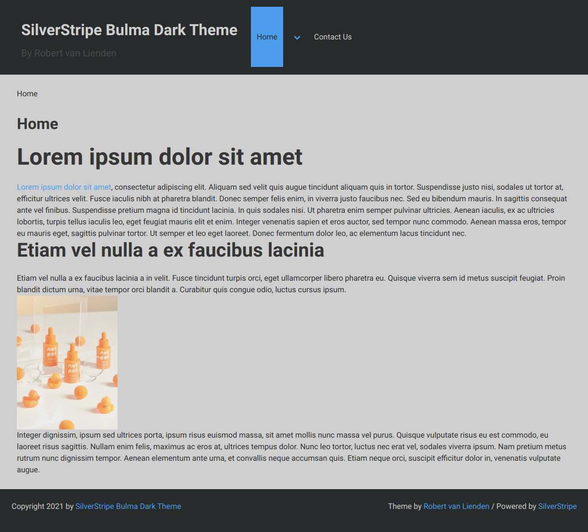

# SilverStripe Bulma Dark Theme
By Robert van Lienden (https://www.robertvanlienden.nl - Twitter [@Robertvlienden](https://www.twitter.com/robertvlienden))

This theme is a great start if you want to use [Bulma CSS Framework](https://bulma.io/) for your [SilverStripe](https://silverstripe.org) site.



## Requirements

### Installation
- SilverStripe 4

### Development
- Node Package Manager (npm)
- Node Version Manager (nvm)

## Installation

- `composer require robertvanlienden/silverstripe-bulma-dark-theme`
- Change your `app/_config/theme.yml` to:
```yaml
---
Name: mytheme
---
SilverStripe\View\SSViewer:
themes:
- '$public'
- 'silverstripe-bulma-dark-theme'
- '$default'

```

Follow Add the following steps to add Bulma headings in WYSYWIG editor:

- Add the following lines to your `app/_config/mysite.yml`:
```yaml
SilverStripe\Forms\HTMLEditor\TinyMCEConfig:
  editor_css:
    - 'themes/silverstripe-bulma-dark-theme/css/editor.css'
```

- Add the following code to `app/_config/_config.php`:
```php
use SilverStripe\Forms\HTMLEditor\TinyMCEConfig;
// .......
$formats = [
    [ 'title' => 'Headings', 'items' => [
        ['title' => 'Heading 1', 'block' => 'h1', 'classes' => 'title is-1'],
        ['title' => 'Heading 2', 'block' => 'h2', 'classes' => 'title is-2'],
        ['title' => 'Heading 3', 'block' => 'h3', 'classes' => 'title is-1'],
        ['title' => 'Heading 4', 'block' => 'h4', 'classes' => 'title is-4'],
        ['title' => 'Heading 5', 'block' => 'h5', 'classes' => 'title is-5'],
        ['title' => 'Heading 6', 'block' => 'h6', 'classes' => 'title is-6'],
        ['title' => 'Heading 6', 'block' => 'h6', 'classes' => 'title is-6'],
        [
            'title'           => 'Subtitle',
            'selector'        => 'p',
            'classes'         => 'title-sub',
        ],
    ]
    ],
];

TinyMCEConfig::get('cms')
    ->addButtonsToLine(2, 'styleselect')
    ->setOptions([
        'importcss_append' => true,
        'style_formats' => $formats,
    ])
    ->removeButtons('formatselect');
```

Now you got the Bulma-styles headings in the WYSIWYG editor!

## Developing

Make sure you got the development requirements and start developing with the following commands:

- `cd <path to this theme>`
- `nvm use`
- `npm install`
- `npm run watch`

Now Gulp is watching for JS/SCSS changes in the src folder.

### Build

Want to make a JS/CSS build for production? Just run;
`npm make build` and let gulp compile the production assets.

## License

This theme is published under MIT License.
Reuse, edit, modify, sell, do whatever you want with this base template.

If you use this theme commercial and make money with this theme, please be kind and do a donation with PayPal (see Donations below).

## Issue/PR

Feel free to make some issue/PR if you find issues/bugs/improvements.

## Donations

Do you want to thank me for making this SilverStripe theme?

Please donate to me with PayPal! You can donate on [Paypal.me/robertvanlienden](http://paypal.me/robertvanlienden).
